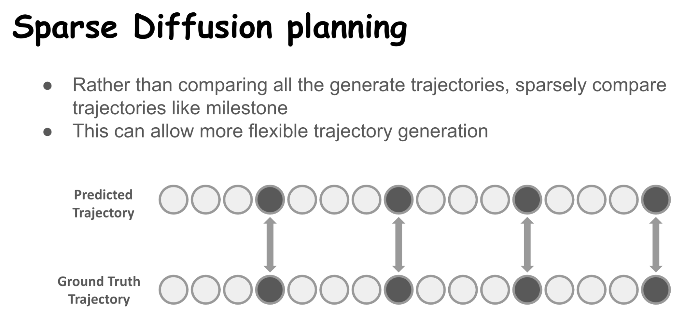

# 🌈 Course Project

**\[CS598\] Conversational AI (Spring 2026\)**  
**\[Course Project\]**  
Proposal Report (score 6/10):  
[https://drive.google.com/file/d/1E2kIj1ChR7fk1hgurQgS6w4N1cmEa8Ya/view?usp=drive\_link](https://drive.google.com/file/d/1E2kIj1ChR7fk1hgurQgS6w4N1cmEa8Ya/view?usp=drive_link)  
Edited Final Presentation (typing error edited, (score: 5/5):  
[https://drive.google.com/file/d/1\_rse3p6YHY0nDWVmqjdI4rBcgs7E5O2v/view?usp=drive\_link](https://drive.google.com/file/d/1_rse3p6YHY0nDWVmqjdI4rBcgs7E5O2v/view?usp=drive_link)  
Final Report (score: 28/30):  
[https://drive.google.com/file/d/1uQB3q6CCeD7U5RwP9-YGPBQnnYQ8KEVj/view?usp=drive\_link](https://drive.google.com/file/d/1uQB3q6CCeD7U5RwP9-YGPBQnnYQ8KEVj/view?usp=drive_link)  
Github:  
[https://github.com/Happiness-Haengbok-Chung/CS598\_ConversationalAI\_2026Spring.git](https://github.com/Happiness-Haengbok-Chung/CS598_ConversationalAI_2026Spring.git)  
Proud to share my work\!❤️This project is currently under the supervision of Professor Dilek-Hakkani-Tür and is receiving the advice from Takyoung Kim at ConvAI and is planned to be further developed for the official publication. i appreciate the invaluable supervision, advice, and lessons 🙇‍♀️  and i’m grateful to receive their supports\! 😃  
**\[Assignments\]**  
Paper Reviews:  
[https://drive.google.com/drive/folders/1JFmvbspUWvLUb-1HC88HpFwtfCUpQiKd?usp=drive\_link](https://drive.google.com/drive/folders/1JFmvbspUWvLUb-1HC88HpFwtfCUpQiKd?usp=drive_link)  
Presentations:  
[https://drive.google.com/drive/folders/11SosOSwrTz8ZwKLGts6D5fzIEpT4w4KS?usp=drive\_link](https://drive.google.com/drive/folders/11SosOSwrTz8ZwKLGts6D5fzIEpT4w4KS?usp=drive_link)  
Because i was too passionate to this course as well, i volunteered to present 1 more presentation although there is no score benefits 🤣 This Conversation AI course was really inspiring so i could further developthe  interest about Conversation AI (encompassing LLM, LMM, healthcare, robotics and other respectful areas as well)\! 

**\[CS417\] Virtual Reality (Spring 2026\)**  
Portfolio: [https://docs.google.com/document/d/1u\_VXFlOSDNbwr-pYXGD0cFZ1luSZDLqL/edit?usp=drive\_link\&ouid=109687750351977204817\&rtpof=true\&sd=true](https://docs.google.com/document/d/1u_VXFlOSDNbwr-pYXGD0cFZ1luSZDLqL/edit?usp=drive_link&ouid=109687750351977204817&rtpof=true&sd=true)  
Final Project Video:  
[https://drive.google.com/file/d/1YCEb4W0P8gq6fWj7K-iZkl41DeV0j5kW/view?usp=drive\_link](https://drive.google.com/file/d/1YCEb4W0P8gq6fWj7K-iZkl41DeV0j5kW/view?usp=drive_link)  
i appreciate Professor D. Livingston McPherson for the invaluable lessons 🙇‍♀️  
In addition, i appreciate all the teammates who collaborated together as well 😀: Julia Stein, Abhinav Angirekula, Chi Jay Xu, Haochen Tong, Runying Chen, Sachidanand (timely ordered)

**\[CS598\] 3D Vision (Fall 2025\)**  
**Report: Exploratory Study of Reinforcement Learning and Imitation Learning (December 2025\)**  
Under the direction of the Professor who led the class, our group focused on the exploratory study 🙇‍♀️Although there was a little difference between the what we pursue among teammates, i sincerely appreciate all of them 😄i did not included the institutional information to be respectful for both institutions (SNU, UIUC, Alphabetical order)  
****  
[https://drive.google.com/file/d/1AOerg57kBiGzw-axDofjSUvfbXx89zM9/view?usp=drive\_link](https://drive.google.com/file/d/1AOerg57kBiGzw-axDofjSUvfbXx89zM9/view?usp=drive_link)

**Presentation: A Novice Version of Inverse Kinematics (October 2025\)**  
Slide Deck: [https://docs.google.com/presentation/d/166mCi2mowuotHpWwZrZZorjkjj-g93oR/edit?usp=drive\_link\&ouid=108595460473080162207\&rtpof=true\&sd=true](https://docs.google.com/presentation/d/166mCi2mowuotHpWwZrZZorjkjj-g93oR/edit?usp=drive_link&ouid=108595460473080162207&rtpof=true&sd=true)  
GitHub:   
[https://github.com/chih-hao-lin/3DV\_2025Fall/tree/main/group\_05\_articulated\_scene/hc101\_novice\_inverse\_kinematics](https://github.com/chih-hao-lin/3DV_2025Fall/tree/main/group_05_articulated_scene/hc101_novice_inverse_kinematics)