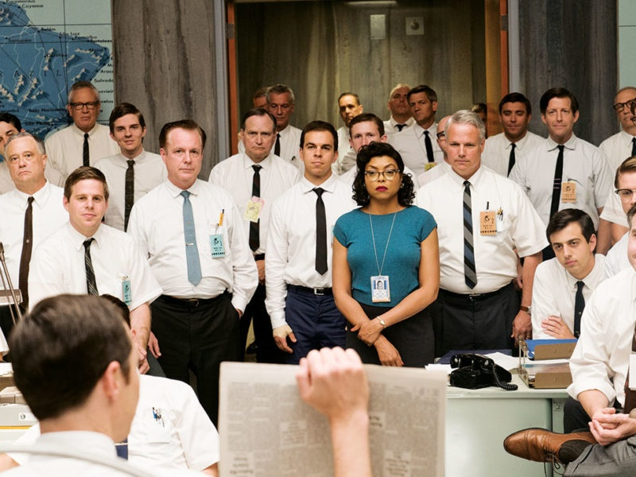
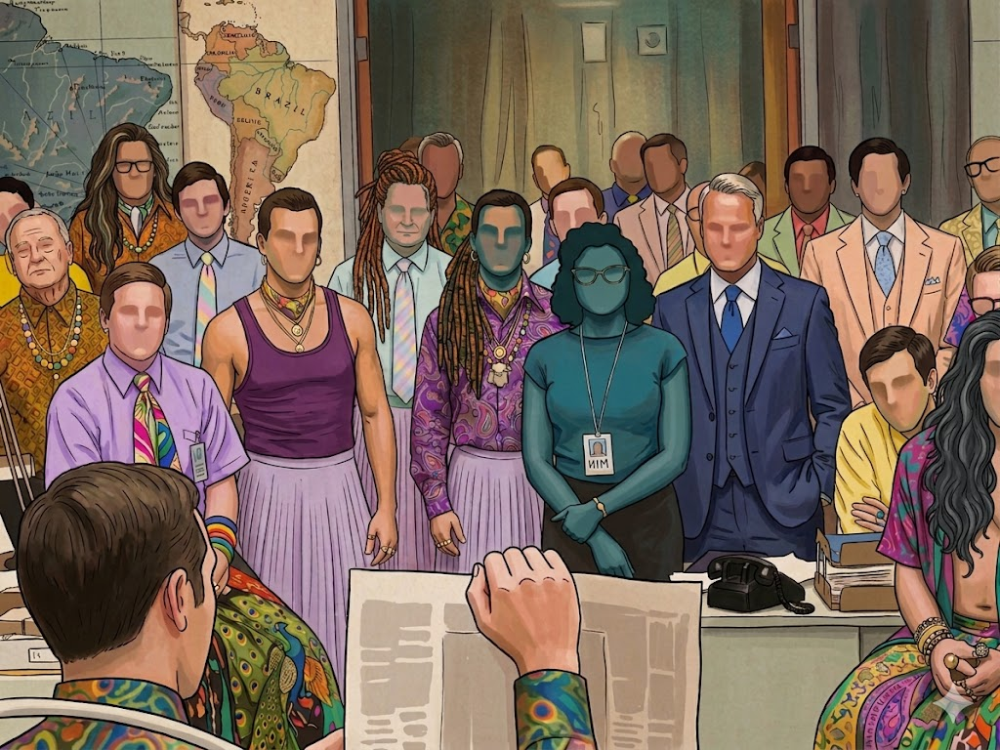

# 🌈 The Figures

🌟**The order of figures follows Alphabetical order, which has no meaning** 🌟

  
**Alan Mathison Turing**  
**1912 \- 1954, United Kingdom**  
**The Turing Test, The Ground of AI**  
**(Reference: https://namu.wiki/w/%EC%95%A8%EB%9F%B0%20%ED%8A%9C%EB%A7%81)**

  
**Alois Alzheimer**  
**1864-1915, Germany**  
**Discovered Alzheimer's Dementia**  
**(Reference: https://namu.wiki/w/%EC%95%8C%EB%A1%9C%EC%9D%B4%EC%8A%A4%20%EC%95%8C%EC%B8%A0%ED%95%98%EC%9D%B4%EB%A8%B8)**

  
**Hannah Arendt**  
**1906 \- 1975, Germany \-\> Prussia \-\> [Stateless](https://en.wikipedia.org/wiki/Statelessness) \-\> United States**  
**Eichmann in Jerusalem: A Report on the Banality of Evil**  
(Reference: https://en.wikipedia.org/wiki/Hannah\_Arendt)

  
**Hedy Lamarr**  
**1914 \- 2000, Austria \-\> Stateless \-\> United States**  
**The Inventor of Frequency Hopping (The Ground of Wi-Fi), Actor**  
(Reference: [https://www.newyorker.com/tech/annals-of-technology/hedy-lamarrs-forgotten-frustrated-career-as-a-wartime-inventor](https://www.newyorker.com/tech/annals-of-technology/hedy-lamarrs-forgotten-frustrated-career-as-a-wartime-inventor))

As far as i know, educational opportunities were not allowed well to womans at that time.   
And she and i are totally different, of course; i’m inferior, cannot be compared;;

  
**Mary F. Scranton**  
**1832 \- 1909, from United States to Korea**  
**First President of Ewha Womans University (1886)**  
(Reference: https://namu.wiki/w/%EB%A9%94%EB%A6%AC%20%EC%8A%A4%ED%81%AC%EB%9E%9C%ED%8A%BC)
